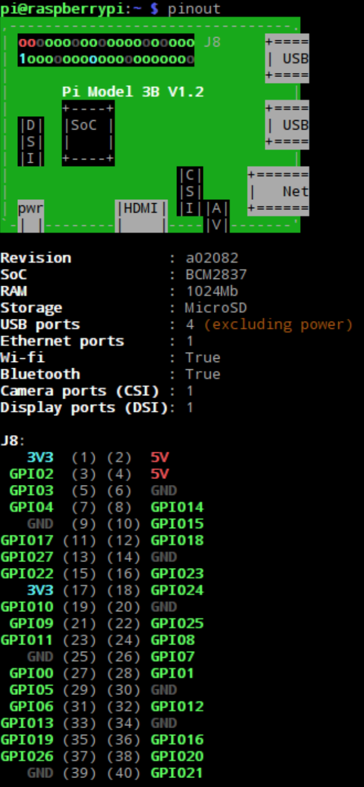

# Raspberry Pi Pins/GPIO

Run the command `pinout` to get a diagram to display a neat diagram of the pins

- Two 5V pins and two 3V3 pins
- Ground pins
- GPIO Pins
  - Outputs: high (3V3) or low (0V)
  - Inputs: high (3V3) or low (0V)

GPIO output/input is configured via software. There is no difference between the pins.

## GPIO Benchmarks
| Raspbi | C                                                                      |
| ------ | ---------------------------------------------------------------------- |
| 1      | 22MHz                                                                  |
| 2      | 41.7MHz                                                                |
| 4      | ~240MHz – big maybe, 6-7 fold increase from Pi 2 suggested by Source 2 |

[[Source 1](https://codeandlife.com/2012/07/03/benchmarking-raspberry-pi-gpio-speed/)]
[[Source 2](https://medium.com/@ghalfacree/benchmarking-the-raspberry-pi-4-73e5afbcd54b)]
